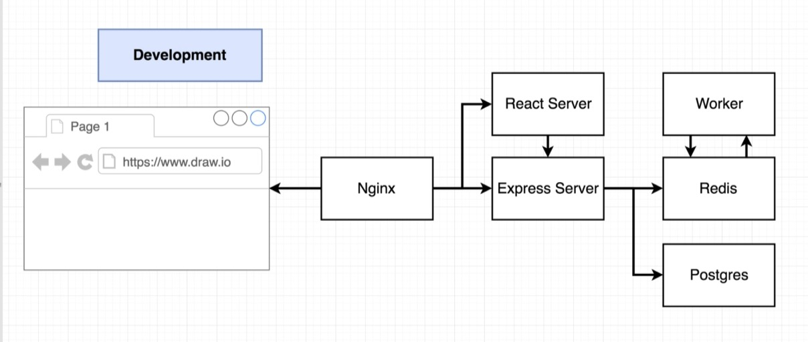
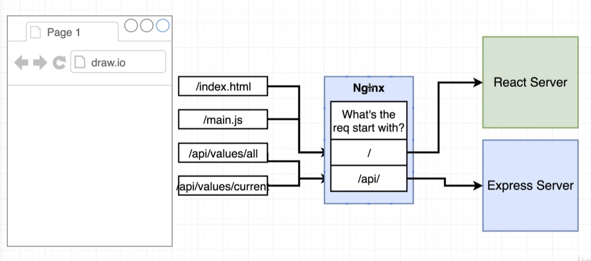
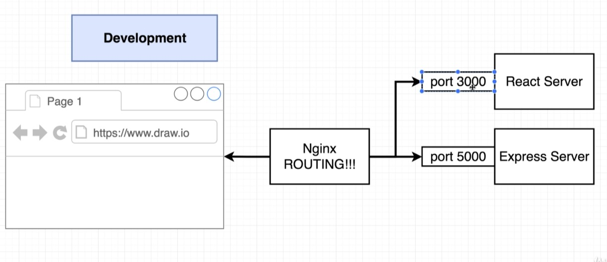
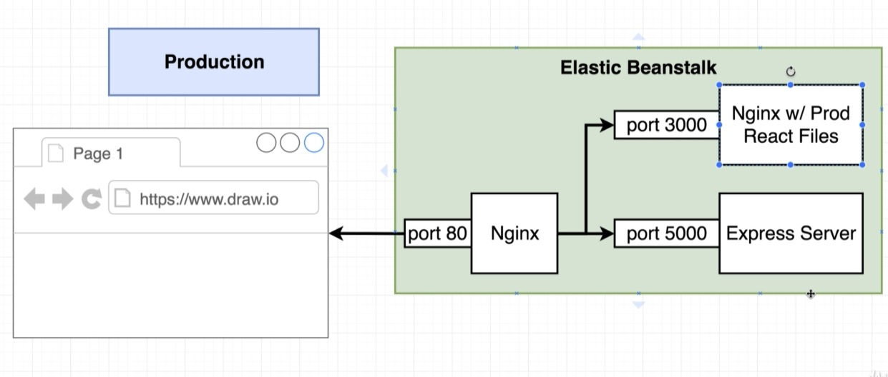
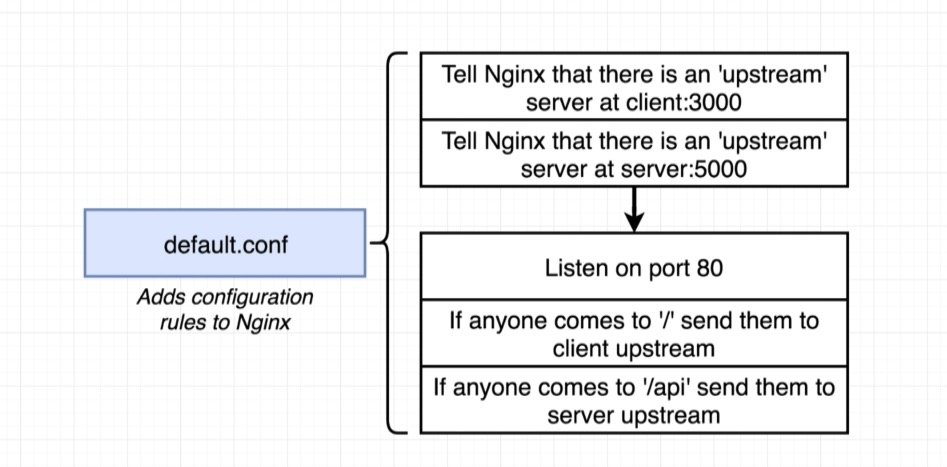

## Overview


## docker compose
```
docker-compose up --build
```

```

version: '3'
services:
  postgres:
    image: 'postgres:latest'
  redis:
    image: 'redis:latest'
  nginx: 
    restart: always
    build:
      dockerfile: Dockerfile.dev
      context: ./nginx
    ports: 
       - '3050:80' 
  api:
    build:
      dockerfile: Dockerfile.dev
      context: ./server
    volumes:
      - /app/node_modules
      - ./server:/app
    environment:
      - REDIS_HOST=redis
      - REDIS_PORT=6379
      - PGHOST=postgres
      - PGPORT=5432
      - PGUSER=postgres
      - PGDATABASE=postgres
      - PG
      
  client:
    build: 
      dockerfile: Dockerfile.dev
      context: ./client
    volumes:
      - /app/node_modules
      - ./client:/app
  worker:
    build: 
      dockerfile: Dockerfile.dev
      context: ./worker
    volumes:
      - /app/node_modules
      - ./worker:/app
    environment:
      - REDIS_HOST=redis
      - REDIS_PORT=6379
  

```


## Why nginx


- no port mappings for express server in docker compose file



## Routing with nginx


```config
# default.conf for nginx

upstream client {
    server client:3000;
}

upstream api {
    server api:5000;
}

server {
    listen 80;

    location / {
        proxy_pass http://client;
    }

    location /api {
        rewrite /api/(.*) /$1 break;
        proxy_pass http://api;
    }
}
```