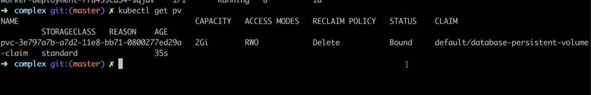

```
brew install kubectl
brew cask install minikube
https://www.virtualbox.org/wiki/Downloads

# minikube start
# minikube ip
# minikube docker-env
# eval $(minikube docker-env)


minikube stop && minikube delete && minikube start --vm=true --driver=hyperkit

minikube addons enable ingress
eval $(minikube -p minikube docker-env)


kubectl apply -f xxxx.yaml

kubectl apply -f k8s/

kubectl get deployments
kubectl get services
kubectl get pods
kubectl get ingresses
kubectl get ep

kubectl logs <pod id>
kubectl logs -f $(kubectl get po | egrep -o 'usermgmt-microservice-[A-Za-z0-9-]+')

kubectl delete deployment client-deployment


kubectl create secret  generic pgpassword \
--from-literal PGPASSWORD=abd12345!

kubectl get secrets

kubectl get storageclass
kubectl describe storageclass
kubectl get pv
kubectl get pvc

kubectl scale --replicas=30 deploy ca-demo-deployment 

Version=$(git rev-parse HEAD)
kubectl set image deployments/server-deployment server=stephengrider/multi-server:$Version

minikube dashboard
```

## Create EKS Node Group in Private Subnets

```
eksctl get nodegroup --cluster=<Cluster-Name>
eksctl get nodegroup --cluster=eksdemo1

eksctl delete nodegroup <NodeGroup-Name> --cluster <Cluster-Name>
eksctl delete nodegroup eksdemo1-ng-public1 --cluster eksdemo1
 
eksctl create nodegroup --cluster=eksdemo1 \
                        --region=us-east-1 \
                        --name=eksdemo1-ng-private1 \
                        --node-type=t3.medium \
                        --nodes-min=2 \
                        --nodes-max=4 \
                        --node-volume-size=20 \
                        --ssh-access \
                        --ssh-public-key=kube-demo \
                        --managed \
                        --asg-access \
                        --external-dns-access \
                        --full-ecr-access \
                        --appmesh-access \
                        --alb-ingress-access \
                        --node-private-networking   
kubectl get nodes -o wide


# Create Cluster without-nodegroup
eksctl create cluster --name=eksdemo1 \
                      --region=us-east-1 \
                      --zones=us-east-1a,us-east-1b \
                      --without-nodegroup 

# Get List of clusters
eksctl get clusters  

```


## Create & Associate IAM OIDC Provider for our EKS Cluster
  
  To enable and use AWS IAM roles for Kubernetes service accounts on our EKS cluster, we must create & associate OIDC identity provider.

```
# Replace with region & cluster name
eksctl utils associate-iam-oidc-provider \
    --region us-east-1 \
    --cluster eksdemo1 \
    --approve
```    

## update kubectl context 
```

cluster_name=photowall-eks-cluster-dev
aws eks update-kubeconfig --name $cluster_name

kubectl config view --minify


https://stackoverflow.com/questions/50791303/kubectl-error-you-must-be-logged-in-to-the-server-unauthorized-when-accessing

cluster_name=photowall-eks-cluster-dev
aws eks update-kubeconfig --name $cluster_name \
--role-arn  arn:aws:iam::717087451485:role/PhotowallCodepipelineBuildPojectRole


```

## Get the IAM role Worker Nodes 
```
# Get Worker node IAM Role ARN
kubectl -n kube-system describe configmap aws-auth

# from output check rolearn
rolearn: arn:aws:iam::180789647333:role/eksctl-eksdemo1-nodegroup-eksdemo-NodeInstanceRole-IJN07ZKXAWNN

```


## Run the Project
```
cd /Users/yongliu/docker_course/multi-k8s

minikube stop && minikube delete && minikube start --vm=true --driver=hyperkit

# https://kubernetes.github.io/ingress-nginx/deploy/#minikube

kubectl apply -f https://raw.githubusercontent.com/kubernetes/ingress-nginx/controller-v0.40.2/deploy/static/provider/cloud/deploy.yaml


# kubectl apply -f ingress-nginx-deploy.yaml

minikube addons enable ingress
eval $(minikube -p minikube docker-env)


kubectl create secret  generic pgpassword \
--from-literal PGPASSWORD=abd12345!

kubectl apply -f k8s_dev/

minikube dashboard

```

## Fix Issue
```
 kubectl get pod -A
kubectl describe pod ingress-nginx-controller-98cb87fb7-pdr6x -n ingress-nginx

 minikube ssh
 docker pull quay.io/kubernetes-ingress-controller/nginx-ingress-controller:0.33.0


```

## Useful docker CMD and images
```
docker system prune

docker run -t --rm -v ~:/root -v /:/mnt/fs -p 8000:8000 coderaiser/cloudcmd

```
## Connect to MySQL
```
kubectl run -it --rm --image=mysql:5.7.22 --restart=Never mysql-client -- mysql -h usermgmtdb.c7hldelt9xfp.us-east-1.rds.amazonaws.com -u dbadmin -pdbpassword11


mysql> show schemas;
mysql> create database usermgmt;
mysql> show schemas;
mysql> exit
```


## Generate Load
```
kubectl run --generator=run-pod/v1 apache-bench -i --tty --rm --image=httpd -- ab -n 500000 -c 1000 http://<Service-Name>.default.svc.cluster.local/ 
```

## Create iamserviceaccount
```
eksctl create iamserviceaccount \
    --name xray-daemon \
    --namespace default \
    --cluster eksdemo1 \
    --attach-policy-arn arn:aws:iam::aws:policy/AWSXRayDaemonWriteAccess \
    --approve \
    --override-existing-serviceaccounts
    

kubectl get sa
 
# Describe Service Account (Verify IAM Role annotated)
kubectl describe sa xray-daemon

# List IAM Roles on eksdemo1 Cluster created with eksctl
eksctl  get iamserviceaccount --cluster eksdemo1

```
## ServiceAccount
```yaml
apiVersion: v1
kind: ServiceAccount
metadata:
  labels:
    app: xray-daemon
  name: xray-daemon
  namespace: default
  # Update IAM Role ARN created for X-Ray access
  annotations:
    eks.amazonaws.com/role-arn: arn:aws:iam::180789647333:role/eksctl-eksdemo1-addon-iamserviceaccount-defa-Role1-VR2R60B6MMDV
---
apiVersion: apps/v1
kind: DaemonSet
metadata:
  name: xray-daemon
  namespace: default
spec:
  updateStrategy:
    type: RollingUpdate
  selector:
    matchLabels:
      app: xray-daemon
  template:
    metadata:
      labels:
        app: xray-daemon
    spec:
      serviceAccountName: xray-daemon
      volumes:
        - name: config-volume
          configMap:
            name: "xray-config"
      containers:
        - name: xray-daemon
          image: amazon/aws-xray-daemon
          command: ["/usr/bin/xray", "-c", "/aws/xray/config.yaml"]
          resources:
            requests:
              cpu: 256m
              memory: 32Mi
            limits:
              cpu: 512m
              memory: 64Mi
          ports:
            - name: xray-ingest
              containerPort: 2000
              hostPort: 2000
              protocol: UDP
            - name: xray-tcp
              containerPort: 2000
              hostPort: 2000
              protocol: TCP
          volumeMounts:
            - name: config-volume
              mountPath: /aws/xray
              readOnly: true
---
# Configuration for AWS X-Ray daemon
apiVersion: v1
kind: ConfigMap
metadata:
  name: xray-config
  namespace: default
data:
  config.yaml: |-
    TotalBufferSizeMB: 24
    Socket:
      UDPAddress: "0.0.0.0:2000"
      TCPAddress: "0.0.0.0:2000"
    Version: 2
---
# k8s service definition for AWS X-Ray daemon headless service
apiVersion: v1
kind: Service
metadata:
  name: xray-service
  namespace: default
spec:
  selector:
    app: xray-daemon
  clusterIP: None
  ports:
    - name: xray-ingest
      port: 2000
      protocol: UDP
    - name: xray-tcp
      port: 2000
      protocol: TCP
```


## Entrie Deployment Flow


## Why Service


## Node port


## Connecting to Running Containers


## The Path to Production


## NodePort vs. ClusterIP


## ClusterIP

 

## Volume


## Volume belongs to Pod


## Volume vs. Persistent Volume 


## What is Persistent Volume Claim 


## PVC 

```yaml

apiVersion: v1
kind: PersistentVolumeClaim
metadata:
  name: database-persistent-volume-claim
spec:
  accessModes:
    - ReadWriteOnce
  resources:
    requests:
      storage: 2Gi

---
apiVersion: apps/v1
kind: Deployment
metadata:
  name: postgres-deployment
spec:
  replicas: 1
  selector:
    matchLabels:
      component: postgres
  template:
    metadata:
      labels:
        component: postgres
    spec:
      volumes:
        - name: postgres-storage
          persistentVolumeClaim:
            claimName: database-persistent-volume-claim
      containers:
        - name: postgres
          image: postgres
          ports:
            - containerPort: 5432
          volumeMounts:
            - name: postgres-storage
              mountPath: /var/lib/postgresql/data
              subPath: postgres
          env:
            - name: PGPASSWORD
              valueFrom:
                secretKeyRef:
                  name: pgpassword
                  key: PGPASSWORD

```


```sh
kubectl get storageclass
kubectl describe storageclass
kubectl get pv
kubectl get pvc

```


```
kubectl get pv
kubectl get pvc
```


## Secret


```
kubectl create secret  generic pgpassword \
--from-literal PGPASSWORD=abd12345!

kubectl get secrets
```
## Secret in yaml 
```yaml
apiVersion: v1
kind: Secret
metadata:
  name: mysql-db-password
#type: Opaque means that from kubernetes's point of view the contents of this Secret is unstructured.
#It can contain arbitrary key-value pairs. 
type: Opaque
data:
  # Output of echo -n 'dbpassword11' | base64
  db-password: ZGJwYXNzd29yZDEx
  
  
---

            env:
            - name: MYSQL_ROOT_PASSWORD
              valueFrom:
                secretKeyRef:
                  name: mysql-db-password
                  key: db-password
                  
```

## Init Containers & livenessProbe & readinessProbe
```yaml

template:
    metadata:
      labels:
        app: usermgmt-restapp
    spec:
      initContainers:
        - name: init-db
          image: busybox:1.31
          command: ['sh', '-c', 'echo -e "Checking for the availability of MySQL Server deployment"; while ! nc -z mysql 3306; do sleep 1; printf "-"; done; echo -e "  >> MySQL DB Server has started";']
          
---

 livenessProbe:
            exec:
              command:
                - /bin/sh
                - -c
                - nc -z localhost 8095
            initialDelaySeconds: 60
            periodSeconds: 10
            
---

  readinessProbe:
            httpGet:
              path: /usermgmt/health-status
              port: 8095
            initialDelaySeconds: 60
            periodSeconds: 10     
            

---

   resources:
            requests:
              memory: "128Mi" # 128 MebiByte is equal to 135 Megabyte (MB)
              cpu: "500m" # `m` means milliCPU
            limits:
              memory: "500Mi"
              cpu: "1000m"  # 1000m is equal to 1 VCPU core                                          
              


```


## Load Balancer


## Ingress 


https://kubernetes.github.io/ingress-nginx/deploy/
